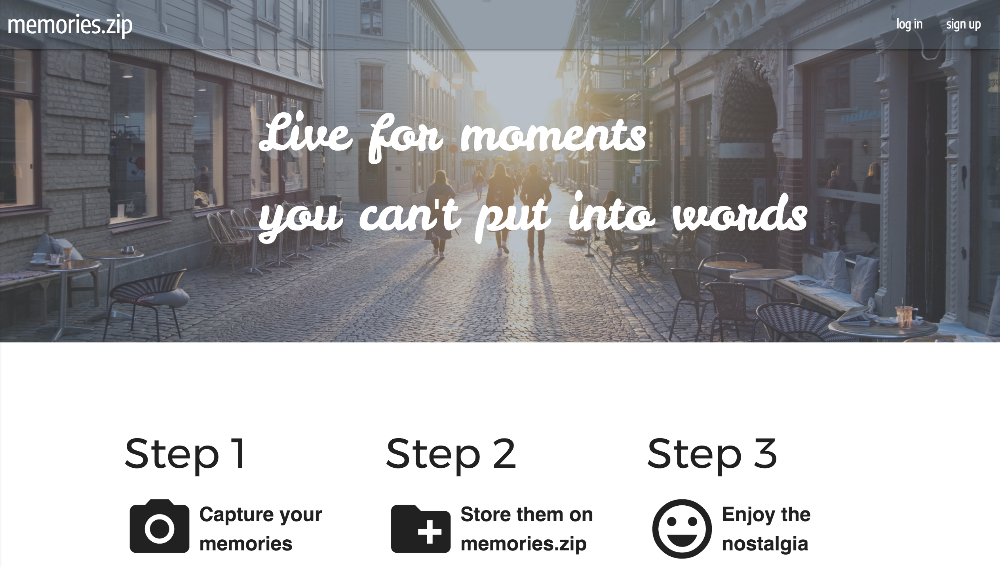

# memories.zip

## Description
Memories.zip is a centralized web app to store all of your memories. Upload photos from events, or trips, and never forget those good times. Designed to give users an easy to use viewing for a nostalgic trip down memory lane.

## Technologies
- MERN Stack
- HTML5
- CSS3
- Javascript
- Imgur API
- React Materialize
- Heroku

## Planning
Check out my Trello [here](https://trello.com/b/omZaCUZp/memorieszip)

## Deployed App
Check out the working app [here](https://memories-zip.herokuapp.com/)

## Unsolved Problems
- In-line editing of memories
- Deleting photos in memories

## Future Enhancements
I plan to solve the unsolved problems listed above, and in addition to that, I plan to be able to invite other users via email to view memories. Those memories will be viewable by all those that the creator shared it with, and private from all other users.